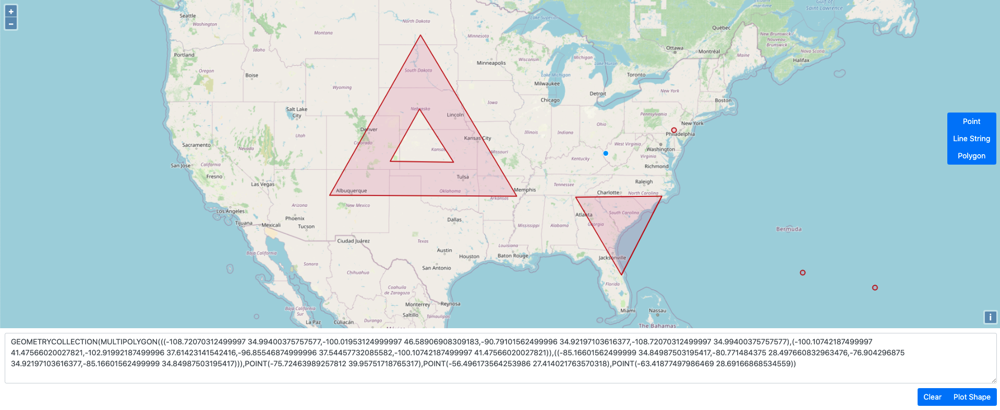

# WKT Playground
When init, if forked from [clydedacruz/openstreetmap-wkt-playground](https://github.com/clydedacruz/openstreetmap-wkt-playground)

Plot [WKT](https://en.wikipedia.org/wiki/Well-known_text) shapes on maps.
    
See it working https://xlxxcc.github.io/map/

